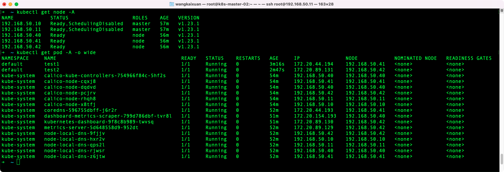
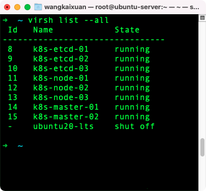

# 整理k8s master和node节点各组件的功能
## kube-apiserver
1. Kubernetes API 服务器验证并配置 API 对象的数据， 这些对象包括
   1. pods
   2. services
   3. replicationcontrollers
   4. ...
2. API 服务器为 REST 操作提供服务，并为集群的共享状态提供前端， 所有其他组件都通过该前端进行交互

## kube-controller-manager
1. 运行控制器进程的控制面板组件 
2. 控制器指：通过监控集群的公共状态，并致力于将当前状态转变为期望的状态
3. 从逻辑上讲，每个控制器都是一个单独的进程， 但是为了降低复杂性，它们都被编译到同一个可执行文件，并在一个进程中运行
4. 这些控制器包括:
   1. 节点控制器（Node Controller）: 负责在节点出现故障时进行通知和响应
   2. 任务控制器（Job controller）: 监测代表一次性任务的 Job 对象，然后创建 Pods 来运行这些任务直至完成
   3. 端点控制器（Endpoints Controller）: 填充端点(Endpoints)对象(即加入 Service 与 Pod)
   4. 服务帐户和令牌控制器（Service Account & Token Controllers）: 为新的命名空间创建默认帐户和 API 访问令牌


## kube-scheduler
1. 控制平面组件，负责监视新创建的、未指定运行节点（node）的 Pods，选择节点让 Pod 在上面运行
2. 调度决策考虑的因素包括
   1. 单个 Pod 和 Pod 集合的资源需求
   2. 硬件/软件/策略约束
   3. 亲和性和反亲和性规范
   4. 数据位置
   5. 工作负载间的干扰和最后时限

## kubelet
1. 指一个在集群中每个节点（node）上运行的代理
2. 它保证容器（containers）都 运行在 Pod 中
3. kubelet 接收一组通过各类机制提供给它的 PodSpecs，确保这些 PodSpecs 中描述的容器处于运行状态且健康
4. kubelet 不会管理不是由 Kubernetes 创建的容器

## kube-proxy
1. 是集群中每个节点上运行的网络代理， 实现 Kubernetes 服务（Service） 概念的一部分
2. kube-proxy 维护节点上的网络规则。这些网络规则允许从集群内部或外部的网络会话与 Pod 进行网络通信
3. 如果操作系统提供了数据包过滤层并可用的话，kube-proxy 会通过它来实现网络规则。否则， kube-proxy 仅转发流量本身

## etcd 
1. etcd 是兼具一致性和高可用性的键值数据库
2. 作为保存 Kubernetes 所有集群数据的后台数据库

# 部署高可用的k8s集群
1. 参考[00-planning_and_overall_intro](https://github.com/easzlab/kubeasz/blob/master/docs/setup/00-planning_and_overall_intro.md)
2. 使用VMware创建2个master，3个etcd，3个node的Ubuntu服务器环境
2. 我使用的配置是
    ```diff
    ➜  kubeasz git:(master) ✗ diff clusters/k8s-01/config.yml example/config.yml
    175c175
    < dns_install: "no"
    ---
    > dns_install: "yes"
    183c183
    < metricsserver_install: "no"
    ---
    > metricsserver_install: "yes"
    187c187
    < dashboard_install: "no"
    ---
    > dashboard_install: "yes"
    ➜  kubeasz git:(master) ✗ diff clusters/k8s-01/hosts example/hosts          
    3,5c3,5
    < 192.168.50.20
    < 192.168.50.21
    < 192.168.50.22
    ---
    > 192.168.1.1
    > 192.168.1.2
    > 192.168.1.3
    9,10c9,10
    < 192.168.50.10
    < 192.168.50.11
    ---
    > 192.168.1.1
    > 192.168.1.2
    14,16c14,15
    < 192.168.50.40
    < 192.168.50.41
    < 192.168.50.42
    ---
    > 192.168.1.3
    > 192.168.1.4
    ```
1. 运行结果:  